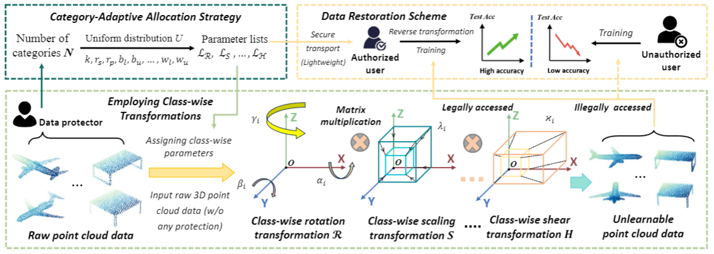

# UnlearnablePC
The official implementation of our NeurIPS 2024 paper "*[Unlearnable 3D Point Clouds: Class-wise Transformation Is All You Need](https://arxiv.org/pdf/2410.03644)*", by *[Xianlong Wang](https://wxldragon.github.io/), [Minghui Li](http://trustai.cse.hust.edu.cn/index.htm), [Wei Liu](https://wilmido.github.io/), [Hangtao Zhang](https://scholar.google.com.hk/citations?user=H6wMyNEAAAAJ&hl=zh-CN), [Shengshan Hu](http://trustai.cse.hust.edu.cn/index.htm), [Yechao Zhang](https://scholar.google.com.hk/citations?user=6DN1wxkAAAAJ&hl=zh-CN&oi=ao), [Ziqi Zhou](https://zhou-zi7.github.io/), and [Hai Jin](https://scholar.google.com.hk/citations?user=o02W0aEAAAAJ&hl=zh-CN&oi=ao).*

 


 


## Abstract
Traditional unlearnable strategies have been proposed to prevent unauthorized users from training on the 2D image data. With more 3D point cloud data containing sensitivity information, unauthorized usage of this new type data has also become a serious concern. To address this, we propose the first integral unlearnable framework for 3D point clouds including two processes: (i) we propose an unlearnable data protection scheme, involving a class-wise setting established by a category-adaptive allocation strategy and multi-transformations assigned to samples; (ii) we propose a data restoration scheme that utilizes class-wise inverse matrix transformation, thus 
enabling authorized-only training for unlearnable data. This restoration process is a practical issue overlooked in most existing unlearnable literature, i.e., even authorized users struggle to gain knowledge from 3D unlearnable data. Both theoretical and empirical results (including 6 datasets, 16 models, and 2 tasks) demonstrate the effectiveness of our proposed unlearnable framework. 
<p align="center">
  
</p>


## Latest Update
| Date       | Event    |
|------------|----------|
| **2024/10/21** | We have released the official implementation of UnlearnablePC!  |
| **2024/10/07** | The paper (arXiv version) is available at [UnlearnablePC](https://arxiv.org/pdf/2410.03644)!|
| **2024/09/26** | UnlearnablePC is acccepted by NeurIPS 2024!  |

## Start Running UnlearnablePC
- **Get code**
```shell 
git clone https://github.com/CGCL-codes/UnlearnablePC.git
```

- **Build environment**
```shell
cd UnlearnablePC
conda create -n UnlearnablePC python=3.9
conda activate UnlearnablePC
pip install -r requirements.txt
```


